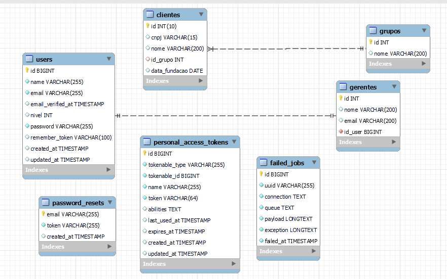
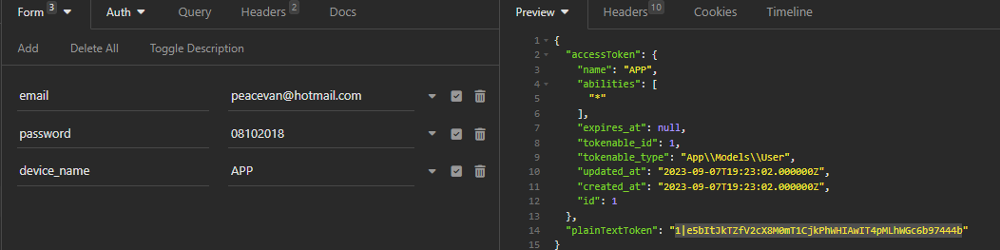
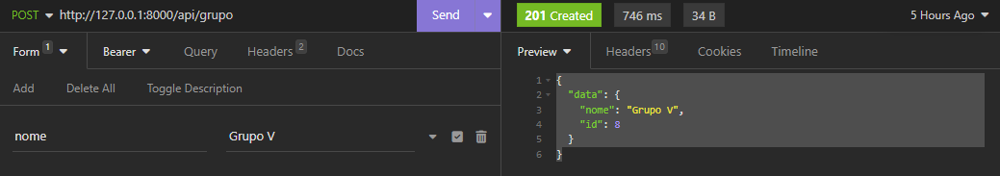
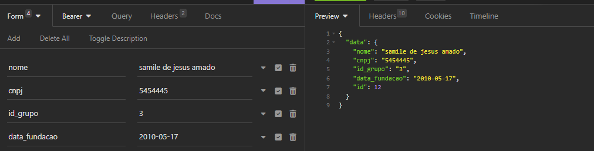
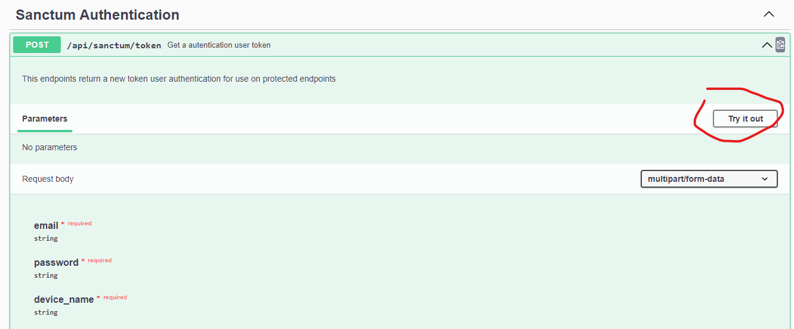
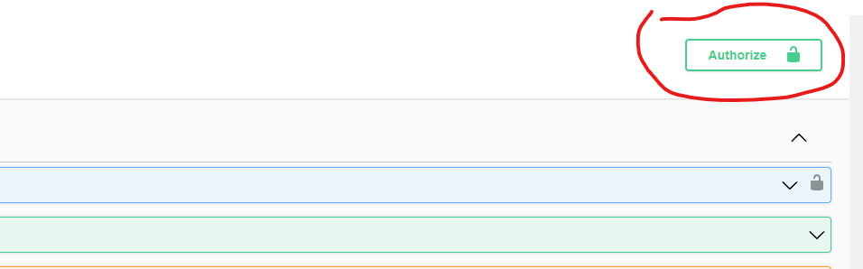

# Teste_Back_end_php


>Desenvolver uma API RESTful utilizando Laravel ou Lumen.

### Cenário

Em nossa auto peças surgiu a demanda que nossos gerentes pudessem separar nossos clientes em grupos distintos. Nossos gerentes têm dois níveis.

### Requisitos
- [x] Um cliente deve pertencer a apenas um grupo;
- [x] Gerentes precisam estar autenticados;
- [x] Gerentes de nível um pode apenas visualizar grupos, adicionar/remover clientes;
- [x] Gerentes de nível dois são os únicos que podem criar, editar e excluir grupos;
- [x] Não fazer "fork" do repositório;
- [x] Ao finalizar, criar um repositório no github e mandar o link para o email dep.web@drugovich.com.br

### Modelos
- [x] Clientes: Código Único, CNPJ, Nome, Data Fundação;
- [x] Gerentes: Código Único, Nome, E-mail, Nível;
- [x] Grupos: Código Único, Nome;
- [ ] Clientes e Gerentes podem ser populados automaticamente.

  
Objetivo
- [x] Queremos endpoints para operar os grupos e visualizar os clientes de um grupo.
 obs: edpoints documetados em: 
 http://localhost:8000/api-documentation#

### Ajustes e melhorias

O projeto ainda está em desenvolvimento e as próximas atualizações serão voltadas nas seguintes tarefas:

- [x] implementar todos os requisitos solicitados
- [x] documentar a API com Swagger
- [ ] Refatorar o código 
- [x] Dockerizar o Projeto 
- [ ] Testes de integração;
- [x] Testes unitários;
- [x] Tratamento de erros.
- [ ] implementar autenticação SSO com KeyClock [melhorias]
- [ ] Clientes e Gerentes podem ser populados automaticamente.
- [ ] realizar deploy para a AWS e disponibilizar um IP público para realização de testes

## 💻 Pré-requisitos

Antes de começar, verifique se você atendeu aos seguintes requisitos:

* Instalação do versão PHP 8.x 
* Composer: O Composer é um gerenciador de pacotes PHP que é usado para instalar e gerenciar as dependências do Laravel.

* Servidor Web: Você precisará de um servidor web para executar seu aplicativo Laravel
* Banco de Dados: Mysql 8.0

* Extensões PHP: Certifique-se de que as extensões PHP necessárias estejam habilitadas no seu servidor. O Laravel pode precisar de extensões como PDO, OpenSSL, Mbstring, Tokenizer, XML, Ctype e JSON.
## 🚀 Instalando teste_back_end_php

Para instalar o teste_back_end_php, siga estas etapas:

```
git clone https://github.com/peacevan/teste-back-end-php-4
cd teste-back-end-php-4
composer install
cp .env.example .env
php artisan key:generate
php artisan migrate
php artisan serve
http://localhost:8000
```
não deu tempo atualizar os migrations por tanto será necessário 
importar algumas tabelas  que estar no script 
dabase/tabala.sql
Em database tambe eoncotra o diagram de entidade relacional

Para executar o projeto  teste_back_end_php no DOCKER siga estas etapas:


1. Instalar o docker-compose, PHP na versão 8.0 e Mysql

2. Docker

2.1 Baixar docker
``` 
sudo apt-get update
sudo apt-get install docker-ce docker-ce-cli containerd.io
sudo systemctl start docker
sudo systemctl enable docker

```
3.2 imagem do php 8.0
``` 
   
```

4. Instalar docker-compose
``` 
   sudo apt install docker-compose
```

5. Execute o comando
``` 
   php composer.phar update
``` 
6. Execute o seguinte comando após atualizar o framework
``` 
    php composer.phar install -vvv
``` 
``` 
    docker-compose up
``` 
7. Acessa a seguinte url:
``` 
    locaohost:8000
``` 

## ☕ Usando teste_back_end_php

Para usar teste_back_end_php, siga estas etapas:

O servidor estará disponível em:
```
http://localhost:8000
```
* A documentação da API está em:

```
http://localhost:8000/api-documentation#
```
* Token de acesso
Um "token do tipo Bearer" refere-se a um tipo específico de token de autenticação
usado em protocolos de autenticação, como o OAuth 2.0. Esse tipo de token é chamado de
"Bearer Token" porque o detentor do token (geralmente um cliente ou aplicativo) simplesmente
o "porta" (ou "apresenta") ao servidor para obter acesso a recursos protegidos, sem a necessidade de
apresentar credenciais adicionais, como nome de usuário e senha a cada solicitação.
  
através do link  da documentação pode ser realizado os testes.


- para ter acesso  aos endpoints protrgidoss é preciso gerar o token de autenticação em 
 http://127.0.0.1:8000/api/sanctum/token
- token precisa ser passado no cabeçalho da requisição


* exemplo de uso no Insominia
* Inserindo Grupo :


* Inserindo Cliente :


* Testando os endpoints via Swagger
 - Gerar o token pelo swagger
 - na sessão sanctum autetication criar em try in out 

 - inserir login e senha  e nome do device
 - clica em authorize  e inserir o token para liberar os endpoints protegidos
   


[⬆ Voltar ao topo](#Teste_Back_end_PHP)<br>
