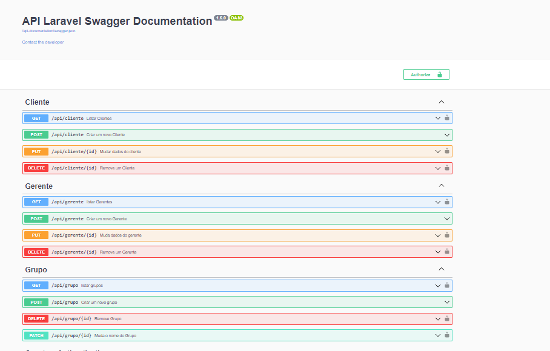

# Teste Back-end PHP



>Desenvolver uma API RESTful utilizando Laravel ou Lumen.

### Cenário

Em nossa auto peças surgiu a demanda que nossos gerentes pudessem separar nossos clientes em grupos distintos. Nossos gerentes têm dois níveis.

### Requisitos
- [x] Um cliente deve pertencer a apenas um grupo;
- [x] Gerentes precisam estar autenticados;
- [x] Gerentes de nível um pode apenas visualizar grupos, adicionar/remover clientes;
- [x] Gerentes de nível dois são os únicos que podem criar, editar e excluir grupos;
- [x] Não fazer "fork" do repositório;
- [x] Ao finalizar, criar um repositório no github e mandar o link para o email dep.web@drugovich.com.br

### Modelos
- [x] Clientes: Código Único, CNPJ, Nome, Data Fundação;
- [x] Gerentes: Código Único, Nome, E-mail, Nível;
- [x] Grupos: Código Único, Nome;
- [x] Clientes e Gerentes podem ser populados automaticamente.
Objetivo
- [x] Queremos endpoints para operar os grupos e visualizar os clientes de um grupo.

### Ajustes e melhorias

O projeto ainda está em desenvolvimento e as próximas atualizações serão voltadas nas seguintes tarefas:

- [x] Tarefa 1
- [x] Tarefa 2
- [x] Tarefa 3
- [ ] Tarefa 4
- [ ] Tarefa 5

## 💻 Pré-requisitos

Antes de começar, verifique se você atendeu aos seguintes requisitos:
<!---Estes são apenas requisitos de exemplo. Adicionar, duplicar ou remover conforme necessário--->
* Você instalou a versão mais recente de `<linguagem / dependência / requeridos>`
* Você tem uma máquina `<Windows / Linux / Mac>`. Indique qual sistema operacional é compatível / não compatível.
* Você leu `<guia / link / documentação_relacionada_ao_projeto>`.

## 🚀 Instalando <nome_do_projeto>

Para instalar o <nome_do_projeto>, siga estas etapas:

Linux e macOS:
```
<comando_de_instalação>
```

Windows:
```
<comando_de_instalação>
```

## ☕ Usando <nome_do_projeto>

Para usar <nome_do_projeto>, siga estas etapas:

```
<exemplo_de_uso>
```

Adicione comandos de execução e exemplos que você acha que os usuários acharão úteis. Fornece uma referência de opções para pontos de bônus!


[⬆ Voltar ao topo](#Teste Back-end PHP)<br>
